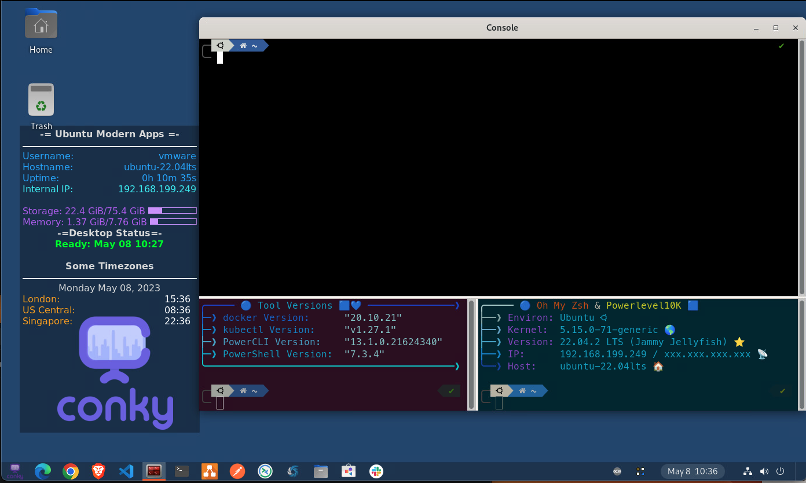

## Purpose

This repo provides a base modern apps developer Ubuntu desktop that includes a number of common tools/utilities. While this is likely not what many might consider their ideal desktop, it does provide a nice foundation for a consistent build using Packer and Bash scripts. I know that a lot of the apps installs/config could be done with Ansible, Salt, etc... but I wanted to keep this pretty minimal for build requirements.

## Build requirements

- Packer 1.8.x
- bash shell (I have only tested this on MacOS and Linux)

### vCenter Builds

- vCenter Server
- Credentials to access vCenter

## How to use

1. Clone this repository locally
2. Copy common.auto.pkrvars.hcl.example to common.auto.pkrvars.hcl
   - Customize common.auto.pkrvars.hcl to suit your needs
3. Copy vsphere.auto.pkrvars.hcl.example to vsphere.auto.pkrvars.hcl
   - Customize vsphere.auto.pkrvars.hcl to suit your environment
4. Move any files from the /scripts/runonce folder to /scripts/disabled if you don't want/need them installed
5. Review/Customize the build.sh script as needed
6. Place a file named "custom-login-screen.png" in the Pictures folder if you wish to have a custom login screen for the desktop.
7. Place a file named "Logo.png" in the Pictures folder if you wish to have a custom logo displayed in the conky desktop widget. If nothing is added there, the build will get the conky logo and place it in the widget.
7. Download the Ubuntu 22.04.2 LTS ISO image https://releases.ubuntu.com/22.04/ubuntu-22.04.2-live-server-amd64.iso and place it on your vCenter Datastore
8. Run the build.sh script - Fix/Update config files if/when error discovered
9. When Script has completed, you should have a snapshot of the newly built VM available (depending on the options you updated in your .hcl files)
10. Perform an initial login as your build user to the desktop
11. Click in the screen to get rid of the overview, then wait for the desktop to change and the Desktop Status to display "READY"
12. Customize the desktop, shortcuts/favorites, etc.. as desired. Install additional agents, join domain, etc... Make note of the IP Address of the desktop
13. Log Out of the desktop - At this point, you can RDP or SSH to the desktop. RDP should have sound enabled as well ;)
14. SSH to the desktop as your build user and execute /root/prep-clone.sh (this will cleanup all the temp files and prepare your desktop for new users to login by updating the /etc/skel directory with your customized settings that were configured as the build user)
15. Shutdown and clone/export/convert to template as desired

## Base build includes

- Sets default shell to zsh with oh-my-zsh and PowerLevel10K prompt
- Disables password prompt for system activities (shutdown, reboot, install software, etc...)
- Allows ALL users to run apt and select other commands using sudo without password
- Install NFS nad CIFS utils for mapping most common file share services in home/lab/enterprise network
- Enables libpam-mount with example .pam_mount.conf.xml in user home dir based on shares created in this video: https://www.youtube.com/watch?v=pme0LcVVQMA 
- Installs bat, yq, jq, gpg, expect, unzip, opem-vm-tools, sshfs, net-tools, wget, exa, terminator, shellcheck, git, and many more....
- Installs my custom banners from https://github.com/burkeazbill/terminal-banners and sets up terminator 3-pane config with custom banners in bottom left and bottom right panes
- Installs/Configures oh-my-zsh and PowerLevel10k theme with supporting fonts
- Install colorls (aliased to ls command for nicer output)
- Installs docker, kind, and docker-compose
- **Kubernetes tools** : kubectl, kubecolor, [mergekube/remkube (Burke's custom scripts)](https://github.com/burkeazbill/MergekubeRemkube), Carvell tools, kubectx/kubens, helm 2, helm 3, MiniKube, IstioCtl, krew, k9s, tilt, MinIO Client
- Conky desktop widget with timezones and logo
- XRDP for RDP access to Desktop
- brew and flatpak package managers
- PowerShell and PowerCLI
- Github CLI
- Installs Gnome Desktop with Dash-to-Panel
- Resizes volume to max size allocated to VM
- Configures /usr/local/bin/login-updates.sh to run at Gnome login
- Configures a pre-shutdown service to run /usr/local/bin/pre-shutdown-script.sh at shutdown/reboot (customize as needed)

## Script includes
- Customize Gnome Settings and dash-to-panel Settings
- Installs aws cli
- Installs Hashicorp tools: packer, vagrant, vagrant-sshfs, vault, terraform, nomad, and consul
- Installs Visual Studio Code + several extensions (Add/Remove extensions in 05-3-install-vs-code.sh file in order to customize)
- Installs Variety wallpaper switcher
- Installs Nextcloud Client
- Installs Skype, Microsoft Teams, Zoom, and Slack
- installs Draw.io
- Installs VLC, OBS, Gimp
- Installs Kontena Lens
- Installs/Keeps updated browsers upon login: Microsoft Edge, Google Chrome, and Brave

### Other Builds

## TODO 

1. I would like to separate the base OS Packer build from the bulk of the scripts. This would allow for:
   - Independent script management
   - Installation of customization scripts on existing Ubuntu 22.xx installs
   - Faster base-image build since it wouldn't be doing all the extra script installs

2. Update the script to prompt for necessary environment inputs and automatically generate the appropriate hcl files

3. I have not created the necessary packer files for these other build options yet:
   - VMware Fusion
   - VMware Workstation
   - VirtualBox
   - Other??
